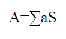
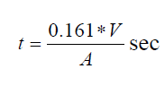

 <h3>Procedure </h3>
<ol type='1'>
<li>Measure the Volume of a hall. </li>

<li> Measure the area of different sound absorbing surfaces. </li>

</ol>

<h3>Observation </h3>

<ol type='1'>

<li> 1. For a hall,  

&emsp;&emsp;&emsp;&emsp;&emsp;&emsp; l = ______m²  

&emsp;&emsp;&emsp;&emsp;&emsp;&emsp; b = _____m²  
 
&emsp;&emsp;&emsp;&emsp;&emsp;&emsp; h = _____m² <li>

<li> Volume of hall,  

&emsp;&emsp;&emsp;&emsp;&emsp;&emsp; l × b × h = _____ m³ </li>

<li> 3. Total absorption  

 </li>

</ol>

<h3> Calculations </h3>

<h3> Observation Table </h3>

<table style='border: 1px solid black;'>
    <tr>
        <th>Object</th>
        <th>Surface Area</th>
        <th>Absorbption Coefficient</th>
        <th>Total Absorption</th>
    </tr>
    <tr>
        <td>Walls</td>
        <td>--</td>
        <td>0.03</td>
        <td></td>
    </tr>
     <tr>
        <td>Floor</td>
        <td>--</td>
        <td>0.01</td>
        <td></td>
    </tr>
     <tr>
        <td>Cielings</td>
        <td>--</td>
        <td>0.04</td>
        <td></td>
    </tr>
     <tr>
        <td>Soft Board</td>
        <td>--</td>
        <td>0.3</td>
        <td></td>
    </tr>
     <tr>
        <td>Wood Door</td>
        <td>--</td>
        <td>0.3</td>
        <td></td>
    </tr>
     <tr>
        <td>Curtains</td>
        <td>--</td>
        <td>0.2</td>
        <td></td>
    </tr>
     <tr>
        <td>Person</td>
        <td>--</td>
        <td>0.46</td>
        <td></td>
    </tr>
     <tr>
        <td>Straw Board</td>
        <td>--</td>
        <td>0.3</td>
        <td></td>
    </tr>

</table>

  

<table style='border: 1px solid black;'>
    <tr>
        <th>Sr No.</th>
        <th>Particular</th>
        <th>Readings</th>
    </tr>
    <tr>
        <td>1</td>
        <td>Length of hall</td>
        <td></td>
    </tr>
    <tr>
        <td>2</td>
        <td>Breadth of hall</td>
        <td></td>
    </tr>
    <tr>
        <td>3</td>
        <td>Height of hall</td>
        <td></td>
    </tr>
    <tr>
        <td>4</td>
        <td>Area of floor</td>
        <td></td>
    </tr>
    <tr>
        <td>5</td>
        <td>Area of Ceiling</td>
        <td></td>
    </tr>
    <tr>
        <td>6</td>
        <td>Area of wall no 1</td>
        <td></td>
    </tr>
    <tr>
        <td>7</td>
        <td>Area of wall no 2</td>
        <td></td>
    </tr>
    <tr>
        <td>8</td>
        <td>Area of door</td>
        <td></td>
    </tr>
    <tr>
        <td>9</td>
        <td>Effective area of wall nuumber 2</td>
        <td></td>
    </tr>
    <tr>
        <td>10</td>
        <td>Effective area of wall nuumber 3</td>
        <td></td>
    </tr>
    <tr>
        <td>11</td>
        <td>Effective area of wall nuumber 4</td>
        <td></td>
    </tr>
    <tr>
        <td>12</td>
        <td>Area of 3 windows</td>
        <td></td>
    </tr>
    <tr>
        <td>13</td>
        <td>Effective area of wall no 4</td>
        <td></td>
    </tr>
    <tr>
        <td>14</td>
        <td>Volume of a hall</td>
        <td></td>
    </tr>
    <tr>
        <td>15</td>
        <td>Total Surface area of a hall</td>
        <td></td>
    </tr>
</table>

<h3>Result</h3>

1. Reverberation time of Physics Laboratory is ____Sec.  
2. Reverberation time of hall is more / less / Optimum.
