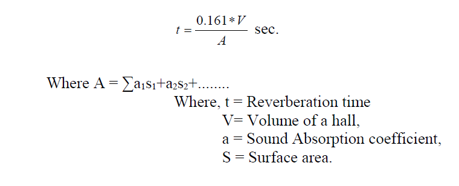
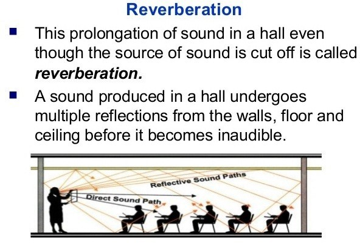

## Apparatus

Meter scale or measuring tape.

## Prior concept

Reflection of sound, Absorption coefficient and Reverberation.

## Sabine’s formula

## Theory

### Reverberation

Reverberation is the phenomenon of persistence of sound in an enclosed room even after it has been stopped as a result of multiple reflections from surfaces such as furniture, people, air etc. within a closed surface/hall/room.

Reverberation time is one of the important parameter to be considered for good acoustic of the hall. Reverberation time is defined as the time required for the decay of sound intensity to 10-6 the value of sound intensity at the time of cut off of sound source. The optimum value of reverberation time is 0.75to 1.25 seconds for auditorium, lecture hall while it is 1.0to 1.5 seconds for music concert. Reverberation time depend on volume of hall and absorption coefficient and total absorbance of sound. Sabine’s formula can be employed to determine reverberation time.

## Diagram

