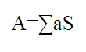

## Procedure

1. Measure the Volume of a hall.

2. Measure the area of different sound absorbing surfaces.

## Observation

### 1. For a hall,

&emsp;&emsp;&emsp;&emsp;&emsp;&emsp; l = ______m²

&emsp;&emsp;&emsp;&emsp;&emsp;&emsp; b = _____m²
 
&emsp;&emsp;&emsp;&emsp;&emsp;&emsp; h = _____m²

### 2. Volume of hall,

&emsp;&emsp;&emsp;&emsp;&emsp;&emsp; l × b × h = _____ m³

### 3. Total absorption

### Calculations

## Observation Table

|   Object    |    Surface Area     | Absorption Coefficient | Total Absorption |
| :---------: | :-----------------: | :--------------------: | :--------------: |
|    Walls    | ___ m² |          0.03          |                  |
|    Floor    | ___ m² |          0.01          |                  |
|  Ceilings   | ___ m² |          0.04          |                  |
| Soft board  | ___ m² |          0.3           |                  |
| Wooden door | ___ m² |          0.3           |                  |
|  Curtains   | ___ m² |          0.2           |                  |
|   Person    | ___ m² |          0.46          |                  |
| Straw board | ___ m² |          0.3           |                  |

| Sr. No. |          Particulars          | Readings |
| :-----: | :---------------------------: | :------: |
|    1    |       Length of a hall        |          |
|    2    |       Breadth of a hall       |          |
|    3    |       Height of a hall        |          |
|    4    |         Area of floor         |          |
|    5    |        Area of ceiling        |          |
|    6    |      Area of wall no.- 1      |          |
|    7    |      Area of wall no.- 2      |          |
|    8    |         Area of door          |          |
|    9    | Effective area of wall no.- 2 |          |
|   10    |      Area of wall no.- 3      |          |
|   11    |      Area of wall no.- 4      |          |
|   12    |       Area of 3 windows       |          |
|   13    | Effective area of wall no.- 4 |          |
|   14    |       Volume of a hall        |          |
|   16    | Total Surface area of a hall  |          |

## Result

1. Reverberation time of Physics Laboratory is ____Sec.
2. Reverberation time of hall is more / less / Optimum.
